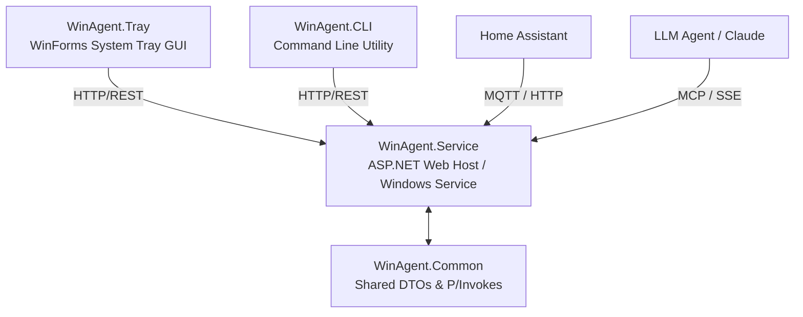

# 🚀 WinAgent (formerly MQTT.Agent)

[]()
[]()
[]()
[]()

> **Notice:** This project has been fully rebranded and refactored from `MQTT.Agent` to `WinAgent`, and completely redesigned around a state-of-the-art **Unified Feature Architecture**.

There is **no backward compatibility** with old `MQTTAGENT_*` configurations or services. If you are upgrading, you must:
1. Stop and uninstall the old `MqttAgent` Windows Service.
2. Update all system-wide and user environment variables from `MQTTAGENT_*` to `WINAGENT_*`.
3. Update your Home Assistant integration from `mqtt_agent` to `win_agent`.
4. Reinstall the service using the new `WinAgent` executable / MSI.

---

## 🏗️ Architectural Overview

WinAgent is a modular Windows automation host, divided into four dedicated subprojects:



### 1. [WinAgent.Common](file:///p:/Visual%20Studio/source/repos/WinAgent/WinAgent.Common) (Class Library)
Houses shared models, DTOs, Win32 P/Invokes, and core helpers, maintaining strict contract synchronization.

### 2. [WinAgent.Service](file:///p:/Visual%20Studio/source/repos/WinAgent/WinAgent.Service) (ASP.NET Core Web Host & Windows Service)
The core host running as a background service. It manages state machines, listens for HTTP/REST and MCP requests, hosts the SSE endpoints, handles MQTT auto-discovery, and performs local system actions.

### 3. [WinAgent.Tray](file:///p:/Visual%20Studio/source/repos/WinAgent/WinAgent.Tray) (Windows Forms GUI)
A sleek, system tray application displaying active hardware metrics and providing quick action menus by consuming `WinAgent.Service` REST APIs.

### 4. [WinAgent.CLI](file:///p:/Visual%20Studio/source/repos/WinAgent/WinAgent.CLI) (Console Application)
A companion CLI utility (`winagent.exe`) that executes features instantly via the local web host's REST API.

---

## ⚡ Unified Feature Architecture

All system control interfaces are built on a central **Feature Engine**. Features are defined by subclassing `BaseFeature` and applying the `[Feature]` attribute:

```csharp
[Feature(Path = "system/lock", Description = "Lock the current active session.")]
public class LockFeature : BaseFeature<EmptyRequest, EmptyResponse> {
    protected override Task<EmptyResponse> ExecuteAsync(EmptyRequest req, CancellationToken ct) {
        LockWorkStation();
        return Task.FromResult(new EmptyResponse());
    }
}
```

A custom Roslyn source generator (`FeatureGenerator.cs`) automatically analyzes these definitions at compile-time and generates:
1. **REST Endpoints**: Exposed automatically at `POST /api/{path}`.
2. **MCP Tools**: Instantly mapped to LLM tool calls.
3. **Dynamic API Docs**: Accessible at `GET /api/docs` (JSON format) and `GET /api/docs?format=md` (Markdown format).

---

## 🔌 Core Features Registry

WinAgent includes over 30 built-in feature endpoints categorized into functional modules:

| Module | Feature Path | Description | Key Arguments |
| :--- | :--- | :--- | :--- |
| **Power** | `system/lock` | Locks the active session | None |
| | `system/logout` | Logs out the current or all users | `allUsers`, `timeout`, `message` |
| | `system/shutdown` | Shuts down the PC | `force`, `timeout`, `message` |
| | `system/reboot` | Reboots the PC | `force`, `timeout`, `message` |
| **Logon** | `system/login` | Local logon automation | `username`, `password`, `wtsConnect` |
| | `system/type_logon` | Types text into logon prompt | `text`, `enter` |
| | `system/clear_credentials` | Clears auto-logon cache | None |
| **System** | `system/notify` | Rich Desktop/VR notifications | `message`, `title`, `toast`, `messagebox` |
| | `system/update` | Triggers Windows Updates | `install`, `rebootIfNeeded` |
| | `process/start` | Remote application launcher | `executable`, `arguments`, `elevated` |
| | `system/list` | System discovery listing | `types` (processes, pipes, com, users) |
| **Hardware** | `hardware/system_summary` | Overview of health, temps & fans | None |
| | `hardware/sensors` | List specific sensor tree metrics | `hardwareIdentifier`, `sensorType` |
| | `hardware/sensor_value` | Query a precise sensor reading | `sensorIdentifier` |
| **Audio** | `system/audio` | Enable/disable devices and control volume | `enable`, `disable`, `setVolumes` |
| **Displays** | `system/displays` | MultiMonitor resolution & power | `action` (turn_on/off/primary), `value` |
| **Devices** | `system/devices` | Manage PnP devices (enable/disable) | `enable`, `disable`, `categories` |
| **Capture** | `capture/screenshot` | Capture display in PNG/JPEG/Base64 | `desktop`, `quality`, `display`, `base64` |
| | `capture/stream` | Multi-screen MJPEG video stream | `fps`, `quality`, `display` |
| **IPC Utilities**| `ipc/named_pipe` | Read/write from system named pipes | `pipeName`, `mode`, `data` |
| | `ipc/mapped_file` | Interface with memory mapped files | `mapName`, `mode`, `data`, `offset` |
| | `ipc/registry` | Read/write registry values | `hive`, `keyPath`, `valueName`, `value` |

---

## 🔒 Authentication

All external API interactions (`/api/*` and `/mcp`) require `Bearer Token` authentication. Set this via the `WINAGENT_TOKEN` environment variable.

Send the token in the HTTP Authorization header:
```bash
Authorization: Bearer <your_token_here>
```

---

## 🛠️ Interface Usage Examples

### 1. HTTP REST API
Exposed on port `23482` by default. Trigger any feature with a JSON POST request:

```bash
curl -X POST http://localhost:23482/api/system/notify \
  -H "Authorization: Bearer YOUR_TOKEN" \
  -H "Content-Type: application/json" \
  -d '{
    "title": "Alert",
    "message": "Intrusion detected in server room!",
    "toast": true,
    "timeoutMs": 10000
  }'
```

### 2. Model Context Protocol (MCP)
LLM agents can connect directly to WinAgent via Server-Sent Events (SSE). 

**Claude Desktop Configuration (`config.json`):**
```json
{
  "mcpServers": {
    "win-agent": {
      "command": "npx",
      "args": ["-y", "@modelcontextprotocol/inspector", "http://localhost:23482/mcp"]
    }
  }
}
```
*Note: Make sure `WINAGENT_TOKEN` is exported in the LLM agent's host environment or configured in the connection query.*

### 3. Command Line Interface (CLI)
Query and trigger feature endpoints natively using the CLI companion (`winagent.exe`). Arguments are parsed dynamically:

```powershell
# Lock the screen
winagent system/lock

# Start a process elevated
winagent process/start --executable "cmd.exe" --arguments "/c sfc /scannow" --elevated

# Send a rich notification
winagent system/notify --title "Build System" --message "Compilation Complete!" --toast --timeoutMs 5000
```

---

## 🏡 Home Assistant Integration

A companion custom integration is provided inside `hass_integration/custom_components/win_agent`. It registers the PC as a Home Assistant device with automatic MQTT sensor discoveries and exposes native Service Calls.

### Exposed Service Calls

| Service | Fields | Purpose |
| :--- | :--- | :--- |
| `win_agent.notify` | `message`, `title`, `toast`, `messagebox`, `timeout_ms` | Sends rich alerts to the PC |
| `win_agent.start_process` | `executable`, `arguments`, `elevated`, `wait_for_exit` | Launches apps/commands on the PC |
| `win_agent.lock` | None | Locks the Windows user session |
| `win_agent.shutdown` | `force`, `timeout`, `message` | Initiates system shutdown |
| `win_agent.reboot` | `force`, `timeout`, `message` | Initiates system reboot |
| `win_agent.logout` | `all_users`, `timeout`, `message` | Logs out user sessions |
| `win_agent.login` | `username`, `password`, `domain`, `wts_connect` | Unlocks and logs in the local session |
| `win_agent.type_logon` | `text`, `enter` | Types automation strings into logon |
| `win_agent.audio` | `enable`, `disable`, `set_volumes` | Selects devices and sets volumes |
| `win_agent.displays` | `action`, `monitor`, `value` | Manages resolutions and power states |
| `win_agent.devices` | `enable`, `disable`, `categories` | Performs PnP hardware overrides |
| `win_agent.update` | `install`, `reboot_if_needed` | Initiates Windows Updates |
| `win_agent.screenshot` | `desktop`, `quality`, `display`, `format`, `base64` | Takes display captures |
| `win_agent.execute_feature`| `path`, `payload` | Dynamic execution of any WinAgent endpoint |

---

## 🚀 Build, Deploy, and Release Lifecycle

An automated management and deployment script is provided at [tools/update.ps1](file:///p:/Visual%20Studio/source/repos/WinAgent/tools/update.ps1).

### Build Solution
To run a clean build with all warnings treated as errors:
```powershell
.\tools\update.ps1 -Build
```

### Local Update/MSI Installation
To compile, package, and execute a local upgrade cycle using the WiX MSI Installer:
```powershell
.\tools\update.ps1 -Stop -Deploy -Start
```

### Create and Publish GitHub Release
To automatically bump project version tokens, commit changes, push, generate harvesting directories, compile the WiX MSI Installer, generate a Scoop-compatible portable ZIP archive, and publish a new tagged release to GitHub:
```powershell
.\tools\update.ps1 -Publish
```

